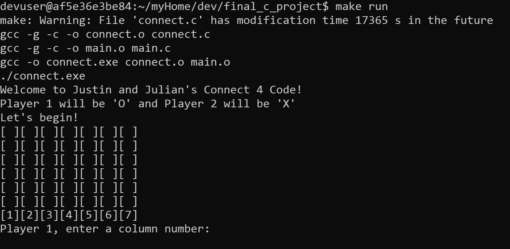

# Connect 4 Program Using C Coding Language
by Julian Lam and Justin Tung for CS 102 Section C Fall 2021

# Introduction
Two players are allowed to play at a time.

Each player will be asked to input a column number to place a "chip" in. 

Player 1's chips are 'O' and Player 2's chips are 'X.'

The chip will fall into the lowest possible slot and the code will check if someone has won

Game will end once a player has achieved 4 in a row horizontally, vertically, or diagonally

# Technical Description
The code uses a 2D array to store a 7x6 "board," like you would normally see in Connect 4.

There are 11 functions in total that can be grouped into three categories: board functions, check functions, and player functions.

Board functions create and manipulate the board. initBoard, as the name implies, initializes the board and defines it as a 7x6 array of empty brackets that represent "slots" that "chips" can be placed into. printBoard, as the name implies, uses a for-loop to print the array row by row. lowestValid is a function that takes a column number and returns the row number of the lowest empty row.

There are also 4 check functions for the 4 types of win conditions: horizontal (--), vertical (|), up diagonal (/), and down diagonal (\). All of them use for loops and if statements, which add to a counter variable when the algorithm encounters a filled slot and reset the counter when it encounters either an empty slot or a slot filled by the other player. If the counter reaches 4, the function returns a value. isWin is a mostly organizational function that checks the return values of all 4 check functions and returns either 1 or 2 depending on which player won.

Finally, there are player functions which takes user inputs and manipulates the board. player1 and player2 are nearly identical functions that prompt the corresponding player for a column number. They use the lowestValid function and the column input to change the corresponding index of the board array to O or X for player1 or player 2, respectively. These functions also ensure that the player inputs a valid column number, so an input like 0 or 8 would not work because there are only 7 columns.

These functions are finalized in the playGame function. Aside from organizing all of the other functions, it also has a turn counter that displays how many turns have gone by and ends the game as soon as isWin returns 1 or 2, OR if the board fills up without a win (turn counter reaches 42). 

# Screenshot of working program

# Link to Youtube Video
https://www.youtube.com/watch?v=Jp25GDwvsfw
